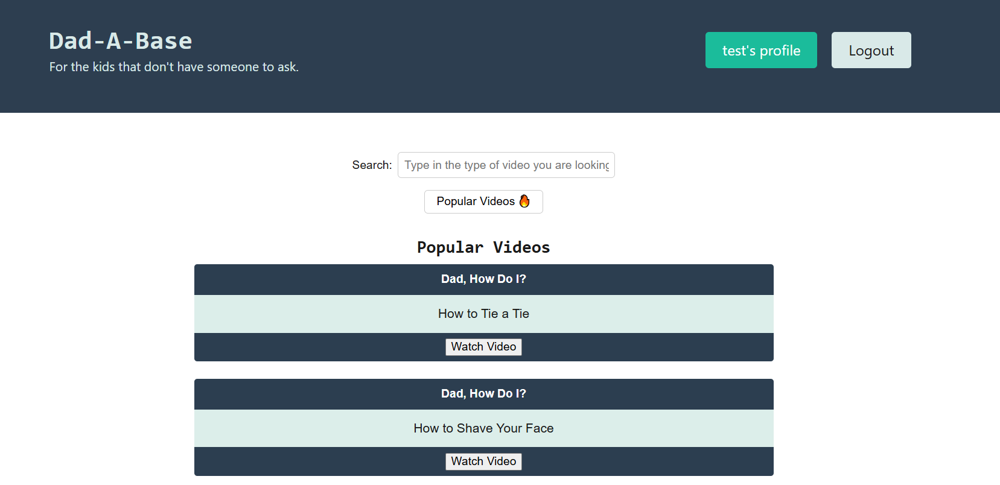
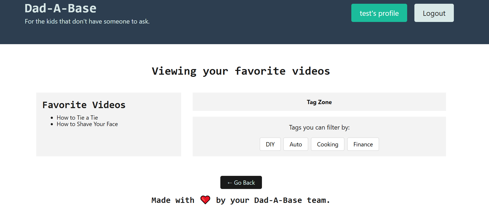

# 🛞 Dad-A-Base 🛠️
Because some kids don’t have someone to ask… so we built a place they could."

## 👔 Description

Ever wondered how to change a tire, tie a tie, or patch a wall without someone around to show you?  
**Dad-A-Base** is your go-to hub for all the grown-up things no one taught you—powered by videos from real parents and trusted creators. No cringe, no fluff, just good advice.

This project allows users to test features before deployment. The reason behind this is for users to have a seamless experience while performing certain actions. Being able to go through the database will help minimize errors. This project uses Cypress testing. I was able to learn how to test out components based off existing code. It helped me get more practice in mapping out each step and adding the proper functions accordingly. 

## Table of Contents 

- [Installation](#installation)
- [Usage](#usage)
- [Credits](#credits)
- [License](#license)

## Installation

These will be the following downloads/ installations that will be necessary. For starters, these libraries will need to be downloaded onto your computer. VS Code, or some sort of code editor, will need to be downloaded as well. Inside the code editor, you will need the Inquirer package downloaded. Running "npm i" in the command terminal will install all the node modules you will need. 

## 🛠️ Tech Stack

- **Frontend**: React + TypeScript
- **Backend**: Node.js, Express, GraphQL
- **Database**: MongoDB with Mongoose ODM
- **Auth**: JWT (Parents sign in, kids get access)
- **Deployment**: Render

## Usage

In order for this project to work properly, you will need to download the libraries onto your local device for use with your code editor. In the code editor, you will open up a terminal and begin installing the node modules. To begin using the application type "npm run build" into the terminal. After this begins you will run "npm run start". This command should begin running the site on your local device. You will also need to install "cypress using command npm install cypress --save-dev".
  
## 🙌 Credits

 🤖 **ChatGPT** – For helping us refine code & bad jokes  
- 🧑‍🏫 **Xpert Learning** – For guidance, support, and "wait, try this instead..." moments  
- 📺 **Amazing YouTube Creators** – For making the world a little less confusing, one how-to at a time:
  - [Dad, How Do I?](https://www.youtube.com/@DadhowdoI)
  - [Mom, How Do I?](https://www.youtube.com/@momhowdoi4105)
  - [How to Dad](https://www.youtube.com/@HowtoDad)
  - [Clean My Space](https://www.youtube.com/@cleanmyspace)
  - [The Financial Diet](https://www.youtube.com/@thefinancialdiet)
  - [Learn How to Adult](https://www.youtube.com/@learnhowtoadult)

## Live Demo Link

## Future Development

- 💬 **Comments & Reactions**  
  Let kids leave feedback on videos (thumbs up, emojis, or “this helped!” notes).
  
  - 🎮 **Mini Quizzes or Challenges**  
  Test what the user learned after watching a video — fun and educational!

## License

MIT License

Copyright (c) [2025]

Permission is hereby granted, free of charge, to any person obtaining a copy
of this software and associated documentation files (the "Software"), to deal
in the Software without restriction, including without limitation the rights
to use, copy, modify, merge, publish, distribute, sublicense, and/or sell
copies of the Software, and to permit persons to whom the Software is
furnished to do so, subject to the following conditions:

The above copyright notice and this permission notice shall be included in all
copies or substantial portions of the Software.

THE SOFTWARE IS PROVIDED "AS IS", WITHOUT WARRANTY OF ANY KIND, EXPRESS OR
IMPLIED, INCLUDING BUT NOT LIMITED TO THE WARRANTIES OF MERCHANTABILITY,
FITNESS FOR A PARTICULAR PURPOSE AND NONINFRINGEMENT. IN NO EVENT SHALL THE
AUTHORS OR COPYRIGHT HOLDERS BE LIABLE FOR ANY CLAIM, DAMAGES OR OTHER
LIABILITY, WHETHER IN AN ACTION OF CONTRACT, TORT OR OTHERWISE, ARISING FROM,
OUT OF OR IN CONNECTION WITH THE SOFTWARE OR THE USE OR OTHER DEALINGS IN THE
SOFTWARE.

## Tests

If everything runs correctly you will see similar pages:

